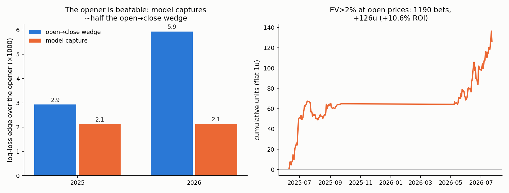

# WNBA Props

**Result: WNBA player-prop opening lines are provably inefficient, and a model
anchored on the opener captures ~half of the open→close wedge out-of-sample —
beating the opener at p = 6e-12 (date-clustered p = 1e-05), positive in all 8
prop markets and in both archived seasons. A flat-stakes simulation betting
EV>2% edges at opening prices goes +10.6% ROI over 1,190 bets with +5.4% CLV
(player-game-clustered t = 2.9 / 2.3). The closing line remains unbeaten
(−0.0023, p = 6e-04), as it should.**

Successor to [beating-the-opener](https://github.com/soldoutbudokan/beating-the-opener)
(soccer 1X2 opener: beaten, 18% of the wedge captured) and
[nba-win-prob](https://github.com/soldoutbudokan/nba-win-prob) (NBA closing
moneyline: unbeatable). WNBA props are a much softer market than either: low
limits, hundreds of prices per slate, and books that are demonstrably slow to
incorporate role changes.



## 🔴 Live FanDuel experiment (2026)

The model is being tested with real money on FanDuel for the rest of the 2026
season: **$100 bankroll (separate from the
[soccer experiment](https://github.com/soldoutbudokan/beating-the-opener)),
quarter-Kelly stakes, judged on CLV**. Running record: **[RESULTS.md](RESULTS.md)**.

How it works — full details in **[live/PROTOCOL.md](live/PROTOCOL.md)**:

1. An hourly cloud routine (`wnba-edge-watch`, Opus 5) refreshes data, retrains,
   and scores today's props into [`live/picks.csv`](live/picks.csv) — but only
   props whose FanDuel price **is still sitting at the opening line** (the
   backtested edge is the stale opener; the model does not beat moved prices).
   It notifies only on strong picks (EV ≥ 6%) or settlements.
2. The user checks FanDuel; if the price is still at/above the sheet's minimum,
   bet the quarter-Kelly stake (one bet max per player per game — combo markets
   are correlated).
3. Fills are reported conversationally to any Claude session; settlement, CLV
   (vs the archived closing snapshot at the bet's own line), P&L, and bankroll
   tracking are automatic.

Backtest expectation at EV≥2%: **+5.4% mean CLV**; positive CLV with losing
P&L still confirms the model, profit with negative CLV is luck.

## The wedge: prop openers are not efficient prices

30,372 graded props (points/rebounds/assists/threes/PRA/combos), 2025 season +
2026 to date, each with an opening line (book + timestamp) and pre-tip closing
prices from multiple books:

- **When the line moves open→close, the move points at the actual result 58.4%
  of the time** (n = 6,853, binomial p = 4e-44). At FanDuel: 59.5% (p = 4e-26).
- Even when the line doesn't move, closing juice beats opening juice on log
  loss: +0.0020 (t = 4.7, p = 2e-06; date-clustered p = 7e-04).
- Openers move 25% of the time overall — 32-39% for points and combo markets.

## Model

One learner, walk-forward (retrained weekly on strictly earlier dates, first 24
days burned in):

1. **Anchor on the market** (the architecture lesson from soccer): convert each
   opening (line, devigged juice) into an implied mean via per-market
   distributions — Normal with fitted σ(μ) for volume stats, Poisson for counts.
2. **Predict the market's own open→close move**, not the outcome. A gradient
   boost on the standardized move, from: box-score EW rates/minutes (wehoop,
   2003-present, leak-free), team pace and opponent context, rest, home,
   availability of teammates, **per-player line-move momentum** (books lag the
   same players repeatedly), and the gap between the opener and a
   fundamentals-only projection.
3. Final mean = market-implied open mean + predicted move; probabilities back
   out through the same distribution.

v1 — regressing the *outcome* residual instead of the move — loses to the close
by −0.028 LL (kept in `src/train_eval.py` for the record). The move is ~6×
less noisy than the outcome; predict the correction, not the result.

## Results (23,659 out-of-sample props, Jun 2025 – Jul 2026)

| | log loss at close line | vs opener |
|---|---|---|
| opener (implied) | 0.69127 | — |
| **model** | **0.68912** | **+0.00215 (t = 7.0, p = 2e-12; clustered p = 1e-05)** |
| close (devigged) | 0.68688 | +0.00439 |

- Beats the opener in **both seasons** (2025: p = 1e-08; 2026: p = 2e-05) and
  positive in **all 8 markets** (7/8 individually significant; assists +ns).
- Move prediction correlates 0.41 with the realized line move.
- vs the close: −0.0023 (p = 6e-04). Honest and expected.
- Numbers above are the **open-safe ablation** (no same-day scratch info; only
  absences already known from prior games). The full model with day-of
  availability is marginally better (+0.00215 vs +0.00213) — the edge is role
  changes and line-move momentum, **not** injury-news sniping.

## Betting simulation (flat 1u at opening prices, open-safe features)

| filter | bets | player-games | ROI | CLV | days positive |
|---|---|---|---|---|---|
| EV>2% | 1,190 | 759 | **+10.6% (t = 2.9)** | **+5.4% (t = 2.3)** | 55% of 141 |
| EV>4% | 595 | 427 | +14.6% (t = 2.3) | +9.5% (t = 2.3) | 56% |
| EV>6% | 318 | 233 | +19.0% (t = 1.8) | +13.8% (t = 1.9) | 55% |

t-stats are clustered by player-game (combo props on one player overlap; a
naive per-bet t would overstate). ~2-3 bets/day in season.

## Caveats, stated plainly

- The "open" is the earliest line BettingPros observed (often FanDuel's);
  betting it requires being there when props post. Lines at soft books do sit
  stale for hours — but the sim assumes the open price was gettable.
- **1.25 seasons of line data.** The upstream archive deletes older seasons
  (2024 was already gone at collection time — the raw 2025+2026 JSON is
  committed under `data/raw/bp/` so this dataset can't disappear). Two more
  seasons (May 2023+) exist behind The Odds API's paid historical tier.
- Prop limits are low (typically $250-1k); this is a bankroll-growth edge, not
  a scalable one. Multi-year robustness cannot be shown with one archive —
  the both-seasons/all-markets consistency and the CLV are the evidence.
- Props void on DNP (mirrored in grading); pushes returned.

## Reproduce

```
python3 src/scrape_bettingpros.py   # archive lines -> data/raw/bp/ (committed)
python3 src/fetch_wehoop.py         # box scores -> data/wehoop/ (gitignored)
python3 src/build_props.py          # flatten archive -> data/props.pkl
python3 src/grade_props.py          # join box scores -> data/graded.pkl
python3 src/wedge.py                # the wedge
python3 src/features.py             # leak-free player-game panel
python3 src/build_modelset.py       # props + features + implied means
python3 src/train_eval_v2.py        # main result (ABLATE_ABSENT=1 for open-safe)
python3 src/make_chart.py           # results/results.png
```
