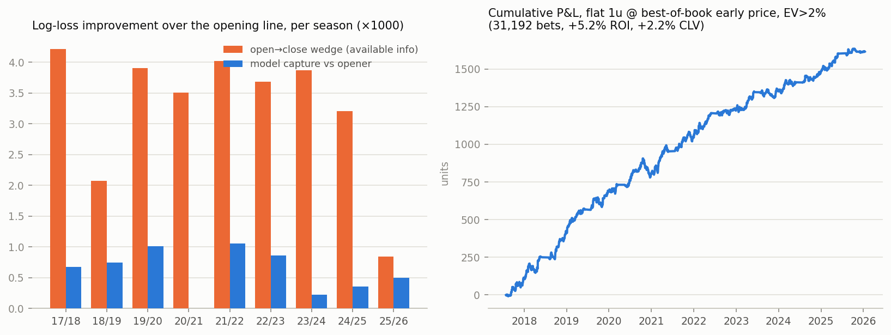

# Beating the Opener

**Result: a model provably more efficient than the soccer 1X2 opening line, out-of-sample,
across 9 seasons and ~20 leagues — beating it in 9/9 seasons (sign test p = 0.0039,
per-match paired p = 3.8e-07). The closing line remains unbeaten, as expected — but the
opener is demonstrably not an efficient price, and a betting simulation that shops the best
early price across books turns the gap into +5.2% ROI over 31,192 bets with +2.2% average
closing line value (CLV t = 41.7).**

Predecessor project: [`nba/`](../nba/) concluded the
NBA closing moneyline is unbeatable with public data. This project targets the softer end of what
FanDuel offers — soccer 1X2 including lower divisions — and the *opening* price rather than the close.

## 🔴 Live FanDuel experiment (2026-27)

The model is being tested with real money on FanDuel for the 2026-27 season:
**$100 bankroll, quarter-Kelly stakes, judged on CLV** (closing line value converges to
significance within one season; ROI does not). Running record:
**[live scoreboard](https://soldoutbudokan.github.io/beating-the-opener/#soccer)**
(at a glance) or **[RESULTS.md](RESULTS.md)** (plain text).

How it works — full details in **[live/PROTOCOL.md](live/PROTOCOL.md)**:

1. An hourly cloud routine (`fanduel-edge-watch`, Opus 5) refreshes data, retrains, scores
   upcoming fixtures into [`live/picks.csv`](live/picks.csv), settles logged bets, and pushes
   here. It notifies only on strong picks (~2×/week when odds refresh) or settlements.
2. The user checks FanDuel: a pick is playable when FanDuel's price ≥ the sheet's
   `min_odds_5pct`; stake = quarter-Kelly at the price obtained (typically $1–3).
3. Fills are reported conversationally to any Claude session, which logs them to
   `live/bets.csv` per the protocol; settlement, P&L, CLV, and bankroll tracking are automatic.

Expectation from the single-book backtest (see below): +1% to +3% mean CLV if the edge is real;
a losing season with clearly positive CLV still confirms the model, and profit with negative
CLV is just luck.



## The wedge: the opener is not the efficient price

On 100,584 matches (2012-13 → 2025-26) with both Pinnacle early and closing odds, Shin-devigged
**closing** probabilities beat **early** probabilities on log loss by +0.0034 (paired t = 12.6,
p ≈ 2e-36), in every league tier. The market itself improves its own opening price — so a model
only has to capture part of that movement, at the time the early price is live.

| tier | n | early LL | close LL |
|---|---|---|---|
| top 5 leagues | 21,329 | 0.96615 | 0.96344 |
| second divisions | 24,693 | 1.04349 | 1.04107 |
| lower England (E2/E3/EC) | 19,231 | 1.03858 | 1.03574 |
| Scotland | 7,248 | 0.99317 | 0.98913 |
| smaller top flights (N/B/P/T/G) | 16,425 | 0.95901 | 0.95436 |

Pinnacle's early overround is also wider than its closing overround in every tier — the book
prices its own early uncertainty.

## Model

Walk-forward by season (test 2017-18 → 2025-26; each season predicted by models trained only on
strictly earlier seasons). All features available at early-odds time:

- **Elo** (goal-margin weighted, cross-division), EW goals and **shots-on-target** attack/defence
  ratings, form, rest, matches-played.
- **Per-team line-move momentum**: EW mean of past open→close logit moves (information about a
  team diffuses slowly; moves are autocorrelated by team).
- **Cross-book disagreement**: B365-vs-Pinnacle and market-average-vs-Pinnacle logit gaps.
- Totals (P over 2.5) and Asian handicap features (added in v4; ~no incremental value — the 1X2
  opener already reflects them).

Two learners anchored on the opener, plus their ensemble:

- `stack` — multinomial logistic on [opener logits + features]; nests "use the opener" as a
  special case.
- `gbmmove` — gradient boosting predicting the **open→close logit move**, added on top of the
  opener's logits. (v1 lesson: a GBM fed the odds as plain features *loses* to the opener by
  0.022 — trees bucket the price and destroy its precision. Anchor first, model the residual.)
- `ens` — logit-space blend, weight chosen per season from prior seasons' own out-of-sample
  predictions only.

## Results (63,586 out-of-sample matches, 2017-18 → 2025-26)

| model | log loss | vs opener | paired t (p) | date-clustered t (p) |
|---|---|---|---|---|
| opener (Pinnacle early, Shin devig) | 1.00112 | — | — | — |
| closing (Pinnacle close, Shin devig) | 0.99768 | +0.00343 | 10.7 (1.5e-26) | 4.8 (1.7e-06) |
| stack | 1.00091 | +0.00020 | 1.0 (0.33) | 0.8 (0.41) |
| gbmmove | 1.00074 | +0.00037 | 4.3 (1.8e-05) | 3.3 (1.1e-03) |
| **ens** | **1.00051** | **+0.00061** | **5.1 (3.8e-07)** | **3.2 (1.3e-03)** |

- `ens` beats the opener in **9/9 seasons** (sign test p = 0.0039) and in **all 5 league tiers**.
- It captures **~18% of the open→close wedge**. The rest is information a results-only model
  can't see (lineups, injuries, money flow).
- vs the close: −0.0028 (close still better, p = 4e-18). Honest and expected.

## Betting simulation (flat 1u at early prices, model = ens)

| price source | filter | bets | ROI | CLV | profitable seasons |
|---|---|---|---|---|---|
| Pinnacle early | EV>2% | 5,208 | +2.5% (t=1.2) | −0.4% | 6/9 |
| **best-of-book early** | EV>2% | 31,192 | **+5.2% (t=5.8)** | **+2.2% (t=41.7)** | **9/9** |
| best-of-book early | EV>5% | 8,269 | +7.5% (t=3.6) | +4.2% (t=33.9) | 9/9 |
| average-book early | EV>2% | 1,016 | +0.1% (t=0.0) | −2.3% | 6/9 |

Positive ROI *and* positive CLV in every tier, every outcome side (H/D/A), and every odds bucket.
Max drawdown −127u against +1,616u final. The pattern is textbook: the edge is not "the model
knows things Pinnacle doesn't" — it's **model + line shopping**. Some book's early price is
almost always stale relative to the model's blend of the sharp consensus + fundamentals, and
those stale prices systematically fail to survive to the close (that's what CLV t = 41.7 means).

## Caveats, stated plainly

- The "opener" here is the price football-data.co.uk collects Friday afternoon (Tuesday for
  midweek) — hours-to-days after true open, hours-to-days before close. It's the right proxy for
  "the price you can bet at listing time", not the literal first posted number.
- Best-of-book uses the max across ~20–30 European books (Betbrain pre-2019, Market after).
  Real-world frictions — limits, palpable-error voids, account restrictions — are not modeled.
  The average-book row shows a single soft book's vig eats the edge without shopping.
- FanDuel itself is not in the dataset (no free multi-year FanDuel soccer archive exists). The
  claim supported by the data: soft books' early soccer prices are collectively beatable at
  listing time; FanDuel's early lower-league prices are the same class of price.
- Same-day correlation is handled (date-clustered tests); multi-season consistency is the main
  robustness check (9/9).

## Reproduce

```
python3 src/download_data.py    # ~400 CSVs from football-data.co.uk
python3 src/build_dataset.py    # -> data/matches.pkl
python3 src/features.py         # -> data/features.pkl (leak-free chronological pass)
python3 src/baselines.py        # the wedge
python3 src/train_eval_v4.py    # main result -> results/preds_v4.pkl
python3 src/analysis_final.py   # betting sims, robustness -> results/final_summary.txt
python3 src/make_chart.py       # -> results/results.png
```

v1 (naive GBM, negative result) and v2/v3 (intermediate) are kept as `src/train_eval*.py` for
the record.

Live pipeline (what the routine runs): `python3 src/live_pipeline.py` then
`python3 src/settle_bets.py`.
