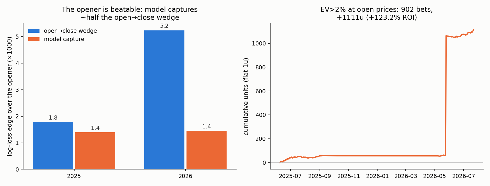

# WNBA Props

**Result: WNBA player-prop opening lines are provably inefficient — the
open→close move points at the actual result 59% of the time (p = 1e-50), and
a model anchored on the opener captures ~55% of the open→close wedge
out-of-sample (LL +0.0018 vs the opener, date-clustered t = 4.8). But the
tradeable version of that edge is small: restricted to FanDuel-priced,
coherently-quoted, correctly-dated props — the only bets the live experiment
can actually make — the flat-stakes sim shows ROI ≈ +3% with t ≈ 0.5 and CLV
vs the raw close of −2.9%. The closing line remains unbeaten (−0.0015), as it
should. An earlier version of this README claimed +10.6% ROI / +5.4% CLV;
that number was inflated by three artifacts (a UTC/ET date-join bug, mispaired
opening quotes, and non-FanDuel openers) documented in [AUDIT.md](../AUDIT.md)
and fixed in the current pipeline.**

Successor to [the soccer 1X2 project](../soccer/)
(soccer 1X2 opener: beaten, 18% of the wedge captured) and
[`nba/`](../nba/) (NBA closing
moneyline: unbeatable). WNBA props are a much softer market than either: low
limits, hundreds of prices per slate, and books that are demonstrably slow to
incorporate role changes.



## 🔴 Live FanDuel experiment (2026)

The model is being tested with real money on FanDuel for the rest of the 2026
season: **$100 bankroll (separate from the
[soccer experiment](../soccer/)),
quarter-Kelly stakes, judged on CLV**. Running record:
**[live scoreboard](https://soldoutbudokan.github.io/beating-the-opener/#wnba)**
(at a glance) or **[RESULTS.md](RESULTS.md)** (plain text).

How it works — full details in **[live/PROTOCOL.md](live/PROTOCOL.md)**:

1. An hourly cloud routine (`edge-watch`, Opus 5, shared with the soccer experiment) refreshes data, retrains,
   and scores today's props into [`live/picks.csv`](live/picks.csv) — but only
   props whose FanDuel price **is still sitting at the opening line** (the
   backtested edge is the stale opener; the model does not beat moved prices).
   It notifies only on strong picks (EV ≥ 6%) or settlements.
2. The user checks FanDuel; if the price is still at/above the sheet's minimum,
   bet the quarter-Kelly stake (one bet max per player per game — combo markets
   are correlated).
3. Fills are reported conversationally to any Claude session; settlement, CLV
   (vs the archived closing snapshot at the bet's own line), P&L, and bankroll
   tracking are automatic.

Backtest expectation at the live rule (FanDuel openers, EV ≥ 3%, side agrees
with the predicted move): **ROI ≈ +3% (t ≈ 0.5), CLV vs the raw close ≈ −3%,
CLV vs the shade-corrected close ≈ +3%** (see the market over-shade note
below). In plain terms: the experiment's honest prior is close to zero edge,
and one season cannot statistically distinguish the observed effect from
nothing (AUDIT.md H7) — the live test is measurement, not harvesting.

## The wedge: prop openers are not efficient prices

30,372 graded props (points/rebounds/assists/threes/PRA/combos), 2025 season +
2026 to date, each with an opening line (book + timestamp) and pre-tip closing
prices from multiple books (all dates ET, joined to the true game — see
AUDIT.md H1 for the bug this replaced):

- **When the line moves open→close, the move points at the actual result 59.0%
  of the time** (n = 6,914, binomial p = 1e-50). At FanDuel: 59.2% (p = 7e-25).
- Even when the line doesn't move, closing juice beats opening juice on log
  loss: +0.0019 (t = 4.5, p = 7e-06; date-clustered p = 7e-04).
- Openers move 25% of the time overall — 32-39% for points and combo markets.

**Market over-shade (AUDIT.md N1):** devigged WNBA prop prices overstate
P(over) by ~2pp on average — at the open *and* the close — so raw prices are
not fair probabilities. The pipeline corrects this with a per-market logit
shift fitted on strictly-past props (expanding window). The correction halves
the walk-forward bias (1.79pp → 0.55pp) but cannot eliminate it: the shade
itself drifts quarter-to-quarter (it was −1.6pp in Jul 2026 after +3.0pp in
Q2), which is why the model may not take a side on the shade alone — every
pick also requires the move model to point the same way.

## Model

One learner, walk-forward (retrained weekly on strictly earlier dates, first 24
days burned in):

1. **Anchor on the market** (the architecture lesson from soccer): convert each
   opening (line, devigged juice) into an implied mean via per-market
   distributions — Normal with fitted σ(μ) for volume stats, Poisson for counts.
2. **Predict the market's own open→close move**, not the outcome. A gradient
   boost on the standardized move, from: box-score EW rates/minutes (wehoop,
   2003-present, leak-free), team pace and opponent context, rest, home,
   availability of teammates, **per-player line-move momentum** (books lag the
   same players repeatedly), and the gap between the opener and a
   fundamentals-only projection.
3. Final mean = market-implied open mean + predicted move; probabilities back
   out through the same distribution.

v1 — regressing the *outcome* residual instead of the move — loses to the close
by −0.028 LL (kept in `src/train_eval.py` for the record). The move is ~6×
less noisy than the outcome; predict the correction, not the result.

## Results (21,909 out-of-sample props, Jun 2025 – Jul 2026)

Coherent quotes at both ends only (same book, same line, booksum 1.00-1.15);
open-safe ablation (`ABLATE_ABSENT=1`); walk-forward with weekly retrains.

| | log loss at close line | vs opener |
|---|---|---|
| opener (implied) | 0.69137 | — |
| **model** | **0.68955** | **+0.00181 (t = 6.6; date-clustered t = 4.8, p = 4e-06)** |
| close (devigged) | 0.68809 | +0.00328 |

- Captures **55% of the open→close wedge**; move prediction correlates 0.34
  with the realized move.
- vs the close: −0.0015 (p = 0.03). Honest and expected.

## Betting simulation (flat 1u at opening prices, live rule)

The live rule: FanDuel-sourced coherent openers only, calibrated model
probability, and the bet side must agree with the predicted move. Two CLV
yardsticks: vs the raw devigged close (what the live scoreboard stamps —
shares the market's over-shade) and vs the shade-corrected close.

| filter | bets | player-games | ROI (pg-t) | CLV vs close | CLV shade-adj |
|---|---|---|---|---|---|
| EV≥2% | 1,379 | 879 | +1.7% (0.0) | −3.1% (−12.7) | +2.7% (8.8) |
| EV≥3% (live list) | 935 | 614 | +3.1% (0.5) | −2.9% (−9.7) | +3.2% (7.8) |
| EV≥6% (live strong) | 281 | 196 | +3.6% (0.6) | −0.8% (−2.1) | +6.3% (7.8) |

t-stats clustered by player-game. Read it plainly: **ROI is statistically
indistinguishable from zero at every threshold**, raw-close CLV is negative
(mechanical for an under-heavy book against an over-shaded close), and the
shade-adjusted CLV is positive only insofar as the measured over-shade
persists — which it did not in Jul 2026. The sheet is ~95% unders. This is
a market worth *measuring*, not yet one worth *betting hard*.

## Caveats, stated plainly

- The "open" is the earliest line BettingPros observed (often FanDuel's);
  betting it requires being there when props post. Lines at soft books do sit
  stale for hours — but the sim assumes the open price was gettable.
- **1.25 seasons of line data.** The upstream archive deletes older seasons
  (2024 was already gone at collection time — the raw 2025+2026 JSON is
  committed under `data/raw/bp/` so this dataset can't disappear). Two more
  seasons (May 2023+) exist behind The Odds API's paid historical tier.
- Prop limits are low (typically $250-1k); this is a bankroll-growth edge, not
  a scalable one. Multi-year robustness cannot be shown with one archive —
  the both-seasons/all-markets consistency and the CLV are the evidence.
- Props void on DNP (mirrored in grading); pushes returned.

## Reproduce

```
python3 src/scrape_bettingpros.py   # archive lines -> data/raw/bp/ (committed)
python3 src/fetch_wehoop.py         # box scores -> data/wehoop/ (gitignored)
python3 src/build_props.py          # flatten archive -> data/props.pkl
python3 src/grade_props.py          # join box scores -> data/graded.pkl
python3 src/wedge.py                # the wedge
python3 src/features.py             # leak-free player-game panel
python3 src/build_modelset.py       # props + features + implied means
ABLATE_ABSENT=1 python3 src/train_eval_v2.py   # headline result (open-safe)
python3 src/make_chart.py           # results/results.png
```
