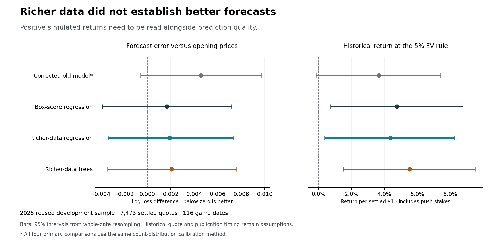

# Does knowing more about the basketball improve the forecast?

Research completed September 6, 2026. This report accompanies the code and saved predictions in this folder.

**We obtained substantially richer WNBA data and tested it. In this experiment, it did not clearly improve predictions over a model using box scores.** That is the most useful result, even though several simulated betting strategies made money.

The added information describes shot locations and types, assisted baskets, historical teammate relationships, opponent tendencies, and involvement at different stages of a game. It comes from about **1.4 million recorded game events**. We compared four approaches, made historical forecasts for points, rebounds, assists and threes, and tested them against reported opening prices.

The best overall probability score belonged to the opening market. Among our four comparable models, the regression using box scores performed best. Adding the richer information made its score slightly worse, with uncertainty large enough to allow either a small improvement or a small deterioration. A more flexible model did not resolve this.

**My recommendation is to keep this research and its data tools, but not promote a richer model into live betting on these results.** The next information to pursue is what will change in the *upcoming* game: likely availability, playing time, role and teammates. This experiment mainly adds detail about games that have already happened.

The left panel compares forecast quality with the opener; farther left is better. The right shows simulated returns from the rule fixed before evaluation. Each horizontal bar represents uncertainty across game dates. These are historical comparisons on a season the project has already used for development, not evidence from a new live trial.

## 1. The concern was worth testing

A final box score tells us that a player scored 18 points. It discards much of the story: whether she attacked the rim or took difficult jumpers, created her own shots or depended on a passer, and had her normal role or an unusual opportunity.

Those distinctions could matter for the next game. Two players averaging 18 points need not have the same chances of exceeding 20.5 against a particular opponent. A rebound average also hides the opportunities created by missed shots, where those misses occurred, and competition from teammates.

However, “more detailed” and “more useful for beating the price” are different claims. Box scores already contain information about ability, opportunity and role. The market also knows a great deal. Richer historical detail must improve a forecast *beyond* that existing information, and improve it enough to survive the bookmaker's margin.

This experiment therefore asks a specific question: **does the new information improve the same type of model, on the same historical quotes?** Changing the data and the model simultaneously would make a favorable result harder to interpret.

## 2. What we actually obtained

We downloaded 85 files, about 48 MB, from a fixed version of [SportsDataverse's WNBA archive](https://github.com/sportsdataverse/wehoop-wnba-data/tree/db0d4921daa58aec06da2931eec713d9e9a52c6e). These contain player and team box scores and schedules from 2003–2025, plus play-by-play from 2010–2025. No 2026 data enters the experiment.

After excluding All-Star games, the feature builder inspected **1,396,755 events across 3,630 games**. The [source guide](SOURCES.md) explains the providers, downloads, official API probes and access limits. The [file manifest](results/source_manifest.json) records exact URLs and checksums, so the inputs can be identified later.

| Information added | What it might help explain | What it cannot establish |
| --- | --- | --- |
| Shots near the rim, other two-pointers, threes and shot distance | Different scoring styles and where missed-shot opportunities arise | How closely a defender contested a shot |
| Driving, pull-up, putback and other recorded shot types | Whether scoring depends on particular ways of creating opportunities | Every action leading up to the shot |
| Assisted makes and the players involved | Which scorers depend on teammates and which passers create recorded baskets | All passes that lead to shot attempts, including misses |
| Recorded actions in quarters and close late-game situations | Changes in involvement and evidence of a player's historical role | Actual time on court in those situations |
| Historical teammate demand and shares | Competition for shots, assists and rebounds in previous supporting casts | Tonight's expected rotation or the effect of an unrecorded injury |
| Opponent shot mix, misses and allowed outcomes | Whether a player's usual strengths match the opportunities an opponent allows | A complete defensive matchup or tracking model |
| Age and amount of usable history | Whether a recent summary deserves confidence | A cure for inaccurate or unobserved information |

The resulting models use **72 box-score and schedule predictors**, with **124 additional predictors** in the richer versions. The [exact list](results/feature_list.json) is saved. Some added columns record missingness or the age of information; 124 does not mean 124 independent basketball insights.

We also checked official WNBA shot and event APIs. They expose useful detail, but the experiment uses the pinned archive for consistent historical coverage. We did **not** obtain continuous player tracking, defender distances, touches, verified rebound chances, or a historical injury feed captured before each opener.

### Richer data needs checking before it becomes evidence

The event descriptions do not always agree with the box scores. We reconstructed made and attempted shots, threes, assists and rebounds and checked them against player totals. If a game's shot information failed, that game's entire shot feature family was unavailable; it did not silently become a set of zeros. The model retained older valid history, together with its age.

| Feature family | Games passing across all 3,630 games | Games passing in competitive 2025 games |
| --- | ---: | ---: |
| Shots | 2,502 | 303 of 311 |
| Assists | 3,484 | 307 of 311 |
| Rebounds | 3,456 | 308 of 311 |

The older shot data is a substantial limitation: 1,128 games failed that family's checks. The 2025 feed is more consistent, but describing the entire 1.4 million events as clean, usable tracking data would be wrong. Coverage records are in [feature quality](results/feature_quality.json), the [2025 quality-only check](results/feature_quality_2025.json), and [source quality](results/source_quality.json). The separate 2025 receipt was produced after evaluation to document these coverage counts; it did not fit or score a model.

## 3. How the models use relationships

All four approaches start from the same basketball forecast. It estimates playing time and a player's per-minute production, then adjusts for game and opponent context. The research adapter includes the most recent eligible completed game and uses league reference values that do not change just because different betting offers appear in a batch.

It then compares these four approaches:

| Name in this report | What it does | What the comparison tells us |
| --- | --- | --- |
| Existing formula, corrected for this research | Uses the existing mean forecast with consistent historical timing and normalization | A reference for the current modeling idea |
| Box-score regression | Learns a restrained correction to that forecast using box scores and schedule/history information | Whether fitting the existing information more effectively helps |
| Rich-data regression | Uses the same correction method with the additional basketball information | The main test of whether the new data helps |
| Rich-data tree model | Learns small branching rules from the richer information and the original forecast | Whether modestly more flexible relationships help |

“Regression” here means learning how much to adjust a forecast when particular measurements change. The fitting procedure penalizes large adjustments, making it harder to mistake a small historical coincidence for a dependable relationship.

The richer regression includes several explicit combinations. For example, it combines a player's tendency to shoot at the rim with the opponent's historical rim profile. It combines a player's rebounding rate with the opponent's missed-shot opportunities. These let the model ask whether a relationship depends on *both* the player and the opponent.

The tree model can make conditional adjustments: a recent role change might matter differently for a player with a stable minutes history than for one with very little history. Its branching and depth of search were deliberately limited. This was not an unrestricted search across hundreds of algorithms.

These are predictive relationships, not proven causes. A coefficient associated with a teammate does not establish what would happen if that teammate were removed. We have not reconstructed reliable five-player lineups or supplied tonight's independently recorded expected rotation.

### Predicting a line requires more than predicting an average

A prediction of 17 points is an average, not a promise and not automatically a fair betting line. A player might have a meaningful chance of scoring very little and a smaller chance of scoring a great deal.

The models therefore produce a spread of possible outcomes. Each saved forecast includes an average, a middle outcome, an approximate 10th-to-90th percentile range, and the probabilities of finishing over, under or exactly on the offered line. An exact tie is treated as a refunded push when the line is a whole number.

For the main four-way comparison, all models use the same family of count distributions, called the negative binomial. This allows more game-to-game variation than a simple Poisson count model. Its average and spread are adjusted using predictions made for 2024, before any 2025 comparison is scored.

The line and price are then used to ask whether a bet pays enough for its estimated chances. **Neither betting lines nor odds are model-training inputs.** We are forecasting basketball outcomes independently, not predicting what the bookmaker will choose to post.

There is an important baseline qualification. The existing model originally used a different probability distribution, and its talent settings were fitted over a later historical period. This research freezes talent fitting before 2015 to keep the training history clean. It also reports the repaired original distribution separately. The baseline is therefore a corrected research adapter, **not an exact replay of the deployed model**.

### One historical forecast, in ordinary terms

For Rhyne Howard's May 16, 2025 game against Washington, the archived points opener was **17.5**, recorded on May 14 at 15:10 UTC. The richer regression forecast an average of **16.8 points**, a middle outcome of **15**, and roughly a 10th-to-90th percentile range of **5 to 32**. It assigned a **60.6% chance of finishing under 17.5**.

The simpler box-score regression assigned a 59.6% chance to the same under. That is the sort of incremental change the experiment tests: did the extra information make those probabilities more accurate across thousands of forecasts? This row illustrates the output, not evidence that either model works. Its exact prices and all four forecasts appear in the [saved sample](results/forecast_examples_8h.csv).

## 4. How the historical test was conducted

The [research plan](PROTOCOL.md) was published before fitting. The implementation and data records were published before scores were inspected. The pre-2025 fitting report was published before the 2025 evaluation. The final evaluation wrote a dated [receipt](results/evaluation_receipt.json) and refuses to overwrite it by silently running again.

| Period | Purpose |
| --- | --- |
| Before 2015 | Establish initial talent assumptions and historical state |
| 2015–2022 | Fit the candidate models |
| 2023 | Choose among the small, predefined model settings |
| 2024 | Check count forecasts and calibrate the spread of predicted outcomes |
| 2025 | Run the fixed comparison against historical opening quotes |

The final mean models are refitted through 2024 before predicting 2025. Their fitted relationships stay fixed during 2025, while player and team histories update as eligible games finish.

For each historical opener, the feature lookup goes back to the information assumed available at that quote's timestamp. It never takes the target game's final minutes or starting status as a pregame input. Historical game and player identities are matched using both teams, the game date and a unique player name; final results are used for grading and identity resolution, not for forecasting features.

We do not know the original publication time of every historical data file. The main test assumes a previous game becomes available eight hours after its start, or one hour after its last timestamped play, whichever is later. A second fixed comparison waits at least 24 hours. Retrospective corrections in today's files remain a limitation under either assumption.

Training examples are made 24 hours before a game; the benchmark uses the actual recorded opener timestamps. Across the accepted all-market archive, the typical opener was about 30 hours before tip, with substantial variation. This difference in forecast horizons is another limitation.

### Which prices and players entered the comparison?

The benchmark uses the repository's existing BettingPros historical archive. It requires the over and under to refer to the same line, bookmaker and timestamp, with a plausible combined margin, before tip-off. It does not combine unrelated prices to manufacture an attractive opening market.

Across all archived markets, there were 16,186 inspected offers and 13,758 accepted paired quotes. FanDuel supplied 82% of those accepted pairs. The four statistics tested here contributed 7,850 paired quotes, of which 7,722 could be uniquely matched to a player in the historical game records.

After requiring sufficient known history and a consistent latest known team, the main test contains **7,604 quotes across 308 games and 116 dates**. Of these, 7,473 have a played outcome and 131 are recorded non-participation voids. All eligible rows have some prior valid history in the three checked play-by-play families; this does not mean their latest game passed every family.

The 128 unmatched four-market quotes are excluded, not quietly graded as losses or wins. Identification through final game records means the sample is not a complete independently captured pregame roster. Known non-participants are treated as refunded voids. The forecasts model production conditional on participating, not the probability of participation itself.

These are provider-reported historical opening quotes. We did not place these bets or verify that every price would have been available to a real account, for the assumed stake, at the reconstructed decision time.

## 5. What happened to forecast accuracy?

The main score is called **log loss**. It rewards assigning sensible probabilities to events that happen and penalizes confident mistakes. Lower is better. Small differences need an uncertainty check; the numbers are not percentages or investment returns.

| Forecast | Overall log loss, lower is better |
| --- | ---: |
| Opening market, with its margin removed | **0.685983** |
| Box-score regression | **0.687662** |
| Rich-data regression | 0.687912 |
| Rich-data tree model | 0.688050 |
| Existing formula with the common count distribution | 0.690533 |

The direct test of added information is the rich-data regression versus the box-score regression. The richer version's score was worse by **0.000250**. The 95% uncertainty interval runs from **−0.000555 to +0.001071**. Negative would favor the richer model; positive favors the box-score model. The interval includes both.

To estimate uncertainty, we repeatedly resampled whole game dates, keeping each date's related forecasts together. This avoids pretending that every player prop is an independent experiment. It still cannot account for every source of uncertainty, such as the project having used 2025 before or an inaccurate source timestamp assumption.

Two other scores tell the same broad story. The richer regression was slightly worse on the Brier score, another check of probability accuracy, and on the likelihood assigned to the actual recorded counts. There is no overlooked large gain hiding behind the choice of the main score.

The repaired original probability distribution scored **0.688298**, considerably closer to the regressions than the common-distribution baseline. It would be misleading to attribute the entire gain over 0.690533 to better basketball information. Some of that comparison depends on how probabilities are constructed.

The opener had the best overall point estimate. Each candidate's uncertainty interval for its difference from the opener includes zero, so this test does not establish a decisive overall winner between the market and any candidate either.

### Different statistics tell different stories

| Statistic | What is encouraging | What prevents a stronger conclusion |
| --- | --- | --- |
| Points | The tree model slightly improves raw count forecasting | Even its offered-line probabilities lag the opener; points remain the clearest weakness |
| Rebounds | Some richer models reduce the average size of count errors | Better averages do not consistently translate into better probabilities at the offered lines |
| Assists | The tree model has the best internal probability score in this market | Its advantage over the opener is uncertain |
| Threes | All candidate point estimates improve on the opener; the box-score model is especially promising | Adding play-by-play worsens the direct regression comparison, so this does not validate the new inputs |

These are subgroup observations from the same development report, not four new independent tests. They should guide a separately planned experiment, not justify retroactively dropping the weaker markets.

The raw count comparison uses 5,574 eligible player-games, including players without offered props, at the fixed 24-hour forecast horizon. For scale, adding the rich regression inputs reduced average points error by about **0.005 points** and rebounds error by about **0.006 rebounds**, while slightly worsening assists and threes. Those are very small changes.

Waiting 24 hours for previous-game data did not change the central conclusion. On that sensitivity, the box-score regression again had the best candidate probability score, and the richer regression's difference from it remained uncertain. The saved results also compare the two timing assumptions on exactly the same set of quotes.

## 6. What happened in the betting simulation?

The rule was fixed before evaluation: at each quote, choose the side with the higher estimated profit per dollar. Bet only if that estimate exceeds the stated threshold. Take the **first qualifying quote for a player in a game**, with at most one $1 bet on that player-game. At exactly the same timestamp, the greater estimated advantage breaks the tie.

This matters because picking the day's best-looking later quote after seeing the whole slate would be a different, less realistic procedure. The simulation respects chronological selection.

At the main **5% estimated-profit threshold**:

| Model | Settled $1 bets | Simulated profit | Return on settled stakes | 95% interval for return |
| --- | ---: | ---: | ---: | ---: |
| Existing formula, common distribution | 2,153 | +$79.02 | +3.67% | −0.16% to +7.42% |
| Box-score regression | 2,125 | +$101.02 | +4.75% | +0.73% to +8.77% |
| Rich-data regression | 2,159 | +$94.19 | +4.36% | +0.37% to +8.28% |
| Rich-data tree model | 2,120 | +$117.45 | +5.54% | +1.50% to +9.52% |

The selections also contain 37, 37, 38 and 39 refunded voids respectively. Voids are excluded from settled stakes and matched expected profit. A whole-number push would contribute a stake and zero profit; these selected historical quotes contain no pushes. No selected outcome remains unresolved.

The second fixed rule required **10% estimated profit**. Returns were +5.62%, +8.48%, +9.04% and +8.20% in the same model order. Both rules are reported in the saved results. The better-looking threshold is not selected afterward as the new recommended strategy.

These profits are worth reporting, but they do not reverse the information test. At the main rule, the rich regression made less than the box-score regression. The tree made more while producing slightly worse overall probability forecasts. Choosing the tree solely because it earned the most in this one replay would reward a favorable historical result without establishing why it should persist.

### The models still promise substantially more than they deliver

For the exact settled bets at the 5% rule, the four models forecast approximately **$385, $371, $380 and $373** of profit. Actual simulated profit was approximately **$79, $101, $94 and $117**. The optimism is substantial even in this profitable season.

Most selections are unders: roughly 87%–91%, depending on the model. After the registered report was complete, we added a clearly labeled exploratory check: take the first available quote per player-game, break simultaneous market ties alphabetically, and always choose under.

That blanket-under policy lost **$47.89 on 2,602 settled $1 bets**, a return of **−1.84%**, with a 95% interval of −5.56% to +1.87%. The 24-hour version also lost money. This particular blanket strategy therefore does not explain the candidates' positive returns. It does not prove the candidate selection is robust, and this control was not part of the original registration.

## 7. My judgment and what should come next

Your concern identifies a real weakness in the project's information: it knows much more about a player's past production than about her opportunity in the next game. This PR addresses that concern directly by obtaining and testing richer data, rather than assuming that a cleaner implementation alone will create an edge.

The result narrows the claim we can make. **This set of public historical play-by-play summaries did not demonstrate extra forecasting value in the controlled comparison.** It does not establish that richer basketball data is useless, or that a good model can never beat the market. It does mean we should not call an architecture an upgrade merely because it has more inputs.

My best guess about the next useful information is:

1. **What is expected to change before the next game.** Timestamped injury status, expected starters, minutes restrictions, returns from injury and roster changes. These would address upcoming opportunity directly. The important requirement is evidence that the information existed before the forecast, not a historical DNP label discovered afterward.
2. **Who actually shares the court.** Verified historical on-court stints could separate a player's opportunities with different teammates. To forecast a future game, those histories must be combined with an independently recorded expected rotation. Aggregate historical teammate shares are only a rough substitute.
3. **Opportunities that did not become box-score totals.** Passes followed by missed shots, rebound chances, touches, contests and defensive matchups could distinguish chance creation from conversion. We need to establish legitimate access and historical coverage before promising a test of those fields.

Those are hypotheses for the next experiment, not explanations proven by this one. We should specify that experiment before opening its results and avoid widening the model search on 2025 until something profitable appears.

The earlier audit and your reply still matter. Forecast-state and timing errors must be repaired to measure whether richer data helps. Their existence alone does not prove they explain the live model's overconfidence or negative closing-price comparison. Small, concrete safeguards and regression checks are proportionate; a large operational redesign is not a prerequisite for useful research. The PR discussion includes the fuller review comments on those distinctions.

## 8. What a reviewer can inspect

The [README](README.md) gives installation, reproduction and verification commands. The original evaluation is preserved; a reproduction writes into a separate directory.

| File or group | What it lets you inspect |
| --- | --- |
| [Research plan](PROTOCOL.md) | Choices made before the model comparisons |
| [Sources](SOURCES.md), [source manifest](results/source_manifest.json), [benchmark coverage](results/benchmark_coverage.json) | Data access, exact input versions, excluded quotes and archive hashes |
| [Fitting report](results/fit_report.json) | Every candidate's pre-2025 fitting and calibration results |
| [Main results](results/results.json), [count results](results/count_results_2025.json) | Both timing assumptions, all models, both betting rules and uncertainty |
| [Full 8-hour forecasts](results/forecasts_8h.csv.gz), [full 24-hour forecasts](results/forecasts_24h.csv.gz) | Player, game, quote source and time, offered line, each forecast distribution and actual outcome |
| [Small readable forecast sample](results/forecast_examples_8h.csv) | The first 80 stored rows, without downloading the full compressed file |
| `results/bets_*.csv` | Every selected bet for each model, timing assumption and threshold |
| [Independent check and exploratory control](results/control_diagnostics.json) | Recomputed scores, selection checks, returns and the later blanket-under diagnostic |
| [Evaluation receipt](results/evaluation_receipt.json) | When the fixed comparison ran and hashes identifying its implementation and main results |

The independent check verified probability accounting and recomputed scores, chronological selections, profits, void accounting and all 16 betting-policy uncertainty intervals from the saved forecasts. It did not rerun the fitted models to regenerate their probabilities. The focused tests also cover latest-game updates, future-data exclusion, delayed sources, unrelated-offer invariance, player matching and whole-number pushes.

There are practical limits to the audit trail. The forecast CSVs identify quotes and predictions but do not contain a full row-by-row list of every underlying historical source. The saved preparation cache permits an independent check of the main eight-hour state queries; the 24-hour state table was rebuilt during evaluation and was not separately saved. Reconstructing that feature lineage requires rerunning preparation from the pinned data. The secondary native-distribution score is stored as a summary, without its individual probabilities.

The chart, reproduction and verification helpers, this report, and the exploratory under control were added after the registered evaluation. They do not alter its model recipe or replace its original results. This PR changes research code and documentation only; it does not deploy a model, modify the live ledger or restart the betting routine.
